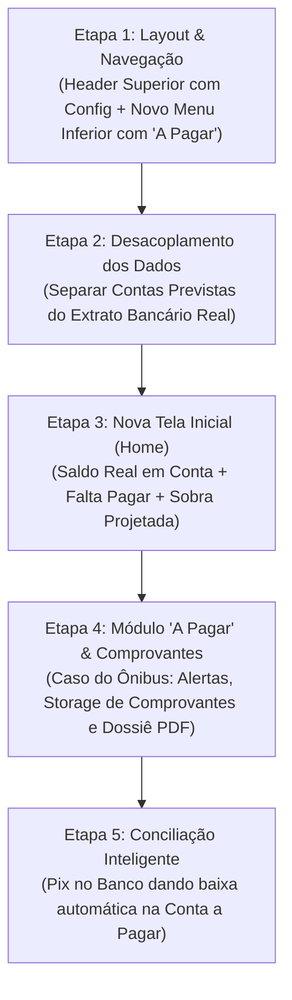

# AppFinanceiro — Status Geral e Roadmap de Evolução

> **Última atualização:** 05/10/2026  
> **Servidor local:** Ativo em [http://localhost:5173/](http://localhost:5173/)  
> **Ambiente:** Supabase (`twoslsjahxigimebgpgj`) + Pluggy Open Finance

---

## 1. Visão Executiva & Mudança de Paradigma

O sistema está evoluindo de uma planilha manual de extrato misturado para uma **plataforma financeira inteligente de dois mundos desacoplados**:

1. **Mundo do Planejamento ("Contas a Pagar / Minha Planilha"):** Onde você controla suas contas programadas (Ônibus R$ 700, Luz, Internet, Financiamentos), datas de vencimento, o que falta pagar, alertas de atraso e comprovantes anexados.
2. **Mundo da Realidade ("Extrato Bancário / Open Finance"):** Onde o dinheiro efetivamente entra e sai dos seus bancos conectados (Mercado Pago, Nubank, etc.), sem tags confusas de pendência em cafezinhos ou compras de rotina.
3. **A Ponte ("Conciliação Automática"):** Quando você faz o Pix no banco, o Open Finance detecta a saída e dá baixa na sua Conta a Pagar automaticamente.

---

## 2. O Que Já Foi Feito (Fases Concluídas & Testadas)

### 2.1 Correções Fundamentais de Arquitetura
- [x] **Zero Loops de Renderização:** Reescrita do [TransactionContext.jsx](src/contexts/TransactionContext.jsx) com memoização e canais Realtime estáveis.
- [x] **Aritmética Estrita em Centavos:** Biblioteca [money.js](src/utils/money.js) + coluna `amount` em `BIGINT` no PostgreSQL.
- [x] **Correção do Multiplicador 100x:** Todas as 267 transações antigas restauradas para os valores exatos (Spotify R$ 13, Nubank R$ 450).
- [x] **Datas e Fusos Horários:** [date.js](src/utils/date.js) com parse local seguro sem transbordamento de mês.
- [x] **Parcelamentos Relacionais:** `installment_group_id` com edição/exclusão em lote no serviço [transactions.js](src/services/transactions.js).

### 2.2 Infraestrutura Open Finance & Pluggy
- [x] **Banco de Dados Supabase:** Tabela `pluggy_items` com RLS + `pluggy_transaction_id UNIQUE` (zero duplicação).
- [x] **Edge Functions Atualizadas para API v2:** `pluggy-sync` e `pluggy-webhook` operando com `/v2/transactions` e deployadas no Supabase.
- [x] **Mecânica das 5 Contas Gratuitas:** Conector proxy `MeuPluggy` (ID: 200) ativo e funcionando.
- [x] **Primeira Conta Real Conectada:** Mercado Pago conectado com **500 transações reais** sincronizadas.
- [x] **Higienização de Dados:** 196 transações de "Dinheiro retirado" (cofrinho) deletadas do banco e filtradas nas Edge Functions.
- [x] **Consolidação de Rendimentos:** Micro-rendimentos diários agrupados em 1 card único consolidado por mês no contexto global.

---

## 3. Novo Plano de Execução em Etapas (Backlog Ativo)

---

### 🔹 ETAPA 1: Reestruturação de Navegação & Layout Base
*Status:* ✅ **CONCLUÍDO (05/10/2026)**
- [x] **NAV-01:** Criar **Header Superior Fixo** em [AppLayout.jsx](src/layouts/AppLayout.jsx) com logo *Fluxo* e atalho para Configurações no topo direito.
- [x] **NAV-02:** Reorganizar a **Barra de Navegação Inferior (Mobile)** e a **Sidebar (Desktop)** com o novo botão **A Pagar** (`/bills`).
- [x] **NAV-03:** Criar a página [Bills.jsx](src/pages/Bills.jsx) e registrar a rota `/bills` no roteador ([App.jsx](src/App.jsx)).

---

### 🔹 ETAPA 2: Desacoplamento de Dados (Planejamento vs Extrato)
*Status:* ✅ **CONCLUÍDO (05/10/2026)**
*Objetivo: Acabar com a mistura de contas manuais e transações bancárias no mesmo feed.*

- [x] **DAT-01:** Separar as coleções de dados no `TransactionContext.jsx`:
  - `plannedBills`: Contas programadas/manuais do mês (`pluggy_transaction_id IS NULL` ou tipo recorrente/fixo).
  - `bankTransactions`: Movimentações reais importadas das contas conectadas (`pluggy_transaction_id IS NOT NULL`).
  - Resumos dedicados `plannedSummary` (Falta Pagar, Já Pago) e `bankSummary` (Fluxo de Caixa Entradas/Saídas).
  - Desacoplamento de `Bills.jsx` para exibir exclusivamente contas a pagar planejadas.
- [x] **DAT-02:** Higienizar a tela de **Extrato** (`Extract.jsx`):
  - Remover etiquetas de *"Pendente/Pago"* de compras e transações bancárias que já foram debitadas/creditadas.
  - Focar a tela em: Saídas bancárias (-), Entradas (+), detalhes do recebedor/pagador e filtro por instituição conectada.
- [x] **PENDÊNCIA (Logo Aleatória):** Revisado e corrigido o sistema de logos (`BankBadge`), implementando Fallback inteligente para leitura prioritária de PNGs locais de alta qualidade (`/public/logos/`).

---

### 🔹 ETAPA 3: Nova Tela Inicial (Dashboard Inteligente)
*Status:* ✅ **CONCLUÍDO (05/10/2026)**
*Objetivo: A tela inicial deve responder na hora quanto você tem de verdade e quanto vai sobrar no mês.*

- [x] **HOM-01:** **Widget de Saldo Real Consolidado:**
  - Exibe o Saldo/Fluxo Mensal do Open Finance.
- [x] **HOM-02:** **Painel de Contas do Mês:**
  - Falta Pagar, Já Pago e Sobra Projetada (`Saldo Real - Falta Pagar`).
- [x] **HOM-03:** **Widget de Próximos Vencimentos:**
  - Lista com os próximos pagamentos (Contas a Pagar).

---

### 🔹 ETAPA 4: Módulo "A Pagar" & Gestão de Comprovantes (Caso do Ônibus)
*Status:* ✅ **CONCLUÍDO (05/10/2026)**
*Objetivo: Resolver na raiz o problema de esquecimentos e cobranças retroativas da agência de transporte.*

- [x] **BIL-01:** Criar a página completa de **Contas a Pagar** (`src/pages/Bills.jsx`):
  - Visão mensal com calendário de vencimentos.
  - Grade de status mês a mês (Janeiro a Dezembro: ✅ Pago, ⚠️ Atrasado, ⏳ A vencer).
- [x] **BIL-02:** **Infraestrutura de Comprovantes (Supabase Storage):**
  - Criar bucket seguro `receipts` no Supabase com políticas de acesso (RLS).
  - Componente de upload no card do pagamento (suporte a fotos, prints e PDFs).
- [x] **BIL-03:** **Exportação de Dossiê em PDF:**
  - Botão *"Exportar Relatório Anual para Agência"*.
  - Gera PDF formatado com tabela de pagamentos (mês, data, valor, código de autenticação bancária) e os comprovantes anexados.

---

### 🔹 ETAPA 5: Conciliação Inteligente (Ponte Pluggy ↔ Contas)
*Status:* ✅ **CONCLUÍDO (05/10/2026)**
*Objetivo: Baixa automática de contas quando o pagamento ocorrer no banco.*

- [x] **CON-01:** Algoritmo de cruzamento na sincronização:
  - Detectar quando uma saída bancária (Pix/Boleto) bate em valor (ex: R$ 700) e data (± 3 dias) com uma conta pendente.
  - Sugerir/executar a baixa automática da conta a pagar, vinculando o comprovante bancário da Pluggy ao lançamento.

---

## 4. Matriz Geral de Prioridades

| Etapa | Módulo | Entregável Principal | Impacto |
|---|---|---|---|
| **Etapa 1** | Layout | Header com Configurações + Botão "A Pagar" no menu | 🟢 Alto (Estrutural) |
| **Etapa 2** | Dados | Separação estrita entre Contas e Extrato Bancário | 🟢 Alto (Conceitual) |
| **Etapa 3** | Home | Saldo Real + Falta Pagar + Sobra Projetada | 🟢 Alto (Decisão Diária) |
| **Etapa 4** | Comprovantes | Histórico anual do Ônibus + Upload de PDFs + Exportação | 🔴 Máximo (Dor do Usuário) |
| **Etapa 5** | Conciliação | Baixa automática via Open Finance | 🟡 Médio (Automação) |

